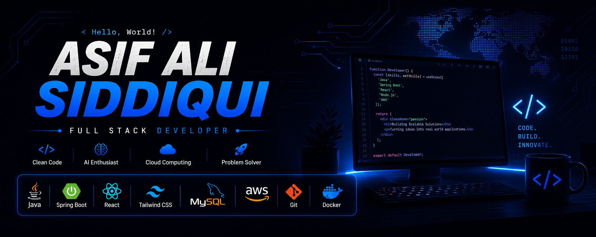

<p align="center">
  
</p>

# 👋 Hi, I'm Asif Ali Siddiqui


### 🎓 MCA Student | 💻 Full Stack Developer | 🤖 AI Enthusiast | ☁️ Cloud Learner


[](mailto:sasifali363@gmail.com)

</div>

---

# 🚀 About Me

```java
class AsifAli {

    String education = "Master of Computer Applications (MCA)";
    String college = "Pimpri Chinchwad College of Engineering";

    String[] interests = {
        "Full Stack Development",
        "Artificial Intelligence",
        "Cloud Computing",
        "System Design"
    };

    String[] currentlyLearning = {
        "Spring Boot",
        "React",
        "AWS",
        "Microservices"
    };

    String goal = "Become a Software Development Engineer";
}
```

---

# 💻 Tech Stack

### 👨‍💻 Languages


### 🌐 Frontend


### ⚙ Backend


### 🗄 Database


### ☁ Cloud & DevOps


---

# 🚀 Featured Projects


⭐ Accessibility Friction rader 

⭐ Deadlock kernal detection 

⭐ Mobile shopping website 
---

# 📊 GitHub Analytics

<p align="center">


</p>

<p align="center">

</p>

---

# 🏆 GitHub Trophies

<p align="center">

</p>

---

# 📈 Contribution Graph


---

# 💬 Quote

> **"First, solve the problem. Then, write the code." – John Johnson**

---

<div align="center">

### ⭐ Thanks for visiting my profile!

If you like my work, don't forget to ⭐ my repositories.

</div>
